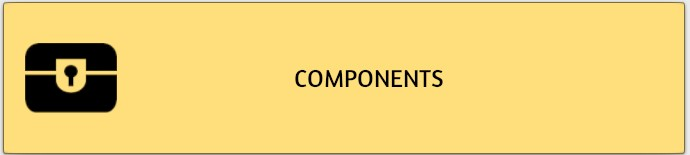

# tts-playing-card-deck-generator

This script turns a set of image
files into a Tabletop Simulator compatible deck of
regular playing cards. 

Each card in the deck is composed of a user specified source image and
the card value (ace of spaces, 5 of diamonds etc).

## Installation

```commandline
git clone https://github.com/lanroth/tts-playing-card-deck-generator.git
cd tts-playing-card-deck-generator
pip install -r requirements.txt
```

## Quickstart

To recreate the sample [card_deck.png](card_deck.png) deck:

```commandline
create_tts_deck.py card_faces/hubble_space_pictures
```

From within Tabletop Simulator:

1. Click the Objects button at the top:  
   
2. Click components:  
   
3. Click Custom:  
   
4. Click Deck:  
   
5. Fill in the dialog:  
   
  - For `Face` browse to the generated image, e.g. `card_deck.png` and upload to `Cloud`.
  - For `Back` browse to an image you'd like for the back of the playing cards and upload to `Cloud`.
  - Click the `IMPORT` button.

I recommend saving the generated deck for easy access:

1. Right click on the deck
2. Save object
3. Give it a meaningful name (e.g. Hubble space cards) and click Save. 

## Detailed usage

```commandline
usage: create_tts_deck.py [-h] [-t TEMPLATE] [-o OUT] [-r] [-a ASPECT_RATIO_TOLERANCE] [-H HIDDEN_CARD] [--display-deck] [--deck-size DECK_SIZE] [-d] input [input ...]

create Tabletop Simulator compatible card deck from template and image files

positional arguments:
  input                 files and directories to look for source images

optional arguments:
  -h, --help            show this help message and exit
  -t TEMPLATE, --template TEMPLATE
                        deck template image (default: card_template.png)
  -o OUT, --out OUT     the generated image file to write (default: card_deck.png)
  -r, --recursive       recurse directories when looking for source images (default: False)
  -a ASPECT_RATIO_TOLERANCE, --aspect-ratio-tolerance ASPECT_RATIO_TOLERANCE
                        1 = aspect ratios must be exact match, 0 = any aspect ratio (default: 0)
  -H HIDDEN_CARD, --hidden-card HIDDEN_CARD
                        image to use for the face of a card that is hidden (default: None)
  --display-deck        display the generated deck image on screen (default: False)
  --deck-size DECK_SIZE
                        number of cards in deck (default: 52)
  -d, --debug           print lots of debug output (default: False)
```

The `-a` argument allows you to ignore source images that aren't of a similar aspect ratio to a playing card:

- `-a0`: allow any aspect ratio
- `-a0.5`: allow aspect ratio of source image to be within 50% of the aspect ratio of a card
- `-a1`: aspect ratios must be exactly the same 

## Why I wrote this

I play card games online with my friends and wanted
to be able to change the faces of the cards as easily as
possible.

There are existing tools to help with this (e.g. the official
[Deck Builder](https://kb.tabletopsimulator.com/custom-content/custom-deck/#deck-builder))
but they require a lot of work to achieve these results.

If I'm going to play cards with a group of friends I've been on holiday with I can quickly
generate a deck for the occasion:

```commandline
create_tts_deck.py "My Photos/Holiday on the Sea of Tranquillity"
```

## How it works

Tabletop Simulator expects a card deck to be a single 
image composed of a grid of 10 x 7 cards. 

Here is a card deck from Tabletop Simulator:


Roughly speaking, for each card in this grid the script:

1. Reads the card
2. Extracts the number and suit from the corners
3. Reads an image provided from the command line
4. scales and crops this image to a card size
5. pastes the number and suit into the corners
6. writes the image into the grid.

The resulting image is written to [card_deck.png](card_deck.png) by default.

The result of executing

```commandline
./create_tts_deck.py  card_faces/hubble_space_pictures
```

is: 

## Included source images

The source images Included in this repo are from here:

https://esahubble.org/products/media/hst_media_0017/
